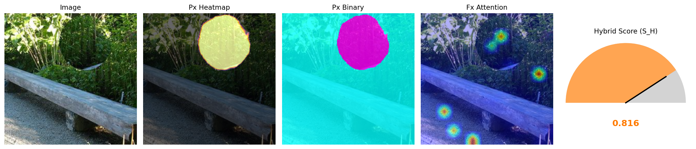

# VAAS: Vision-Attention Anomaly Scoring

[](https://doi.org/10.5281/zenodo.18064355)
[](https://github.com/OBA-Research/VAAS/actions/workflows/test.yaml)
[](https://pypi.org/project/vaas/)
[](https://huggingface.co/OBA-Research/vaas-v1-df2023)
[](https://pypi.org/project/vaas/)
[](LICENSE)


VAAS (Vision-Attention Anomaly Scoring) is a dual-module vision framework for image anomaly detection and localisation.  
It combines global attention-based reasoning with patch-level self-consistency analysis to produce interpretable anomaly scores and dense anomaly maps.

This repository provides the **inference-ready implementation** of VAAS for research engineers and practitioners.

---

## Read Paper
- [Arxiv version](https://arxiv.org/abs/2512.15512)
- [Conference version](https://arxiv.org/abs/2512.15512)

---

## Architecture


VAAS integrates two complementary components:

- **Fx — Global Attention Module**  
  A Vision Transformer capturing semantic/global irregularities from attention patterns.

- **Px — Patch Consistency Module**  
  A SegFormer-based model capturing local inconsistencies across image patches.

These combine to produce:

- `S_F` — global attention fidelity  
- `S_P` — patch-level plausibility  
- `S_H` — hybrid anomaly score (final)

`S_H` is continuous and reflects anomaly **intensity**, not just presence.

---

## Installation

```
pip install vaas
```

**Important:** VAAS requires **PyTorch + torchvision**.  
Install the correct PyTorch build for your system (CPU / CUDA / ROCm):

https://pytorch.org/get-started/locally/

---

## Basic Inference Example

```python
from vaas.inference.pipeline import VAASPipeline
from PIL import Image

pipeline = VAASPipeline.from_pretrained(
    "OBA-Research/vaas-v1-df2023",
    device="cpu",
    alpha=0.5,
)

img = Image.open("image.jpg").convert("RGB")
out = pipeline(img)

print(out)
```

### Output format

```python
{
    "S_F": float,
    "S_P": float,
    "S_H": float,
    "anomaly_map": numpy.ndarray  # shape (224, 224)
}
```

## Inference with visual explanation

VAAS can also generate a qualitative visualization combining:

- Patch-level anomaly heatmaps (Px)
- Global attention maps (Fx)
- Final hybrid anomaly score (S_H)

```python
pipeline.visualize(
    image="image.jpg",
    save_path="vaas_visualization.png",
    mode="all",        # options: "all", "px", "binary", "fx"
    threshold=0.5,
)
```

This will save a figure containing:

* Original image
* Patch-level anomaly overlays
* Global attention overlays
* A gauge-style visualization of the hybrid anomaly score

For examples:




---

## Model Variants

| Version | Training Data | Description |
|--------|----------------|-------------|
| v1     | DF2023 (10%)   | Initial public inference release |

Future updates will include:

- full DF2023 training  
- cross-dataset benchmarking  
- improved calibration  
- more efficient backbones  
- richer visualisation modes  

---

## Example Notebooks

A set of runnable example notebooks covering:


These cover:

- Quick-start inference with VAAS  
- Visualising anomaly maps  
- Batch / folder inference  
- How S_F, S_P, and S_H are combined  
- Device selection (CPU, CUDA, MPS)

If you would like to contribute a notebook, see  
**[CONTRIBUTING.md](CONTRIBUTING.md)** for guidelines.

---

## Roadmap

- Cross-dataset evaluation  
- Larger-scale training  
- Model compression  
- Batch inference and folder-level CLI  
- Extended anomaly-map visualisation  
- Streamlit/Gradio demo (optional)  
- ONNX / TorchScript export  

---

## Contributing

We welcome contributions that improve the usability, robustness, and extensibility of VAAS.

Please see the full guidelines in **[CONTRIBUTING.md](CONTRIBUTING.md)**.

---

## Citation

If you use VAAS in your research, please cite both the software and the associated paper as appropriate.

```python
@software{vaas,
  title        = {VAAS: Vision-Attention Anomaly Scoring},
  author       = {Bamigbade, Opeyemi and Scanlon, Mark and Sheppard, John},
  year         = {2025},
  publisher    = {Zenodo},
  doi          = {10.5281/zenodo.18064355},
  url          = {https://doi.org/10.5281/zenodo.18064355}
}

```

```python
@article{bamigbade2025vaas,
  title={VAAS: Vision-Attention Anomaly Scoring for Image Manipulation Detection in Digital Forensics},
  author={Bamigbade, Opeyemi and Scanlon, Mark and Sheppard, John},
  journal={arXiv preprint arXiv:2512.15512},
  year={2025}
}
```

---

## License

MIT License.

---

## Maintainers

**OBA-Research**  
https://github.com/OBA-Research  
https://huggingface.co/OBA-Research
