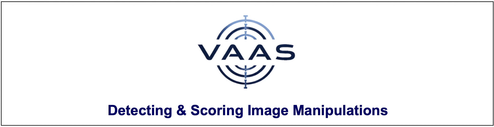
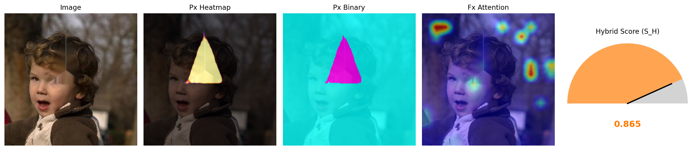
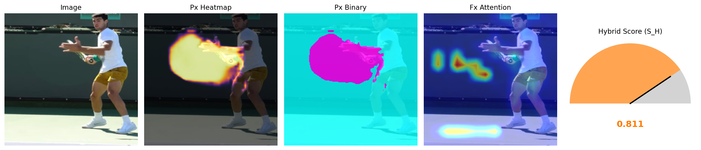
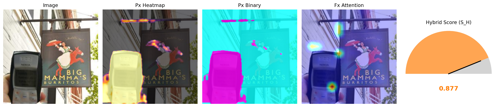

---
# VAAS: Vision-Attention Anomaly Scoring

[](https://doi.org/10.5281/zenodo.18064355)
[](https://github.com/OBA-Research/VAAS/actions/workflows/test.yaml)
[](https://huggingface.co/OBA-Research/vaas-v1-df2023)
[](https://pypi.org/project/vaas/)

[](https://pypi.org/project/vaas/)
[](https://colab.research.google.com/drive/1tBZIMXjDLwjrbnHGNdtVgsyXoaQ2q6KK?usp=sharing)
[](LICENSE)


## What is VAAS?

VAAS is an inference-first, research-driven dual-module vision library for image integrity analysis. It integrates Vision Transformer Attention Mechanisms with patch-level self-consistency analysis to enable fine-grained localization and detection of visual inconsistencies across diverse image integrity analysis tasks

*This repository provides the **inference-ready implementation** of VAAS for research engineers and practitioners.*

---

## Read Paper
- [Arxiv version](https://arxiv.org/abs/2512.15512)
- [Conference version](https://arxiv.org/abs/2512.15512)

---

## Architecture


VAAS integrates two complementary components:

- **Fx — Global Attention Module**  
  A Vision Transformer capturing semantic/global irregularities from attention patterns.

- **Px — Patch Consistency Module**  
  A SegFormer-based model capturing local inconsistencies across image patches.

These combine to produce:

- `S_F` — global attention fidelity  
- `S_P` — patch-level plausibility  
- `S_H` — hybrid anomaly score (final)

`S_H` is continuous and reflects relative anomaly **intensity**, not a binary decision.

---

## Installation

```bash
pip install vaas
```

Or if you prefer using uv:

```bash
uv add vaas
```

**Important:** VAAS requires PyTorch and torchvision at inference time.

The library itself can be installed and imported without PyTorch installed.

Install the correct PyTorch build for your system (CPU / CUDA / ROCm):

https://pytorch.org/get-started/locally/

---

## Usage

### 1. Basic inference on local and online images

```python
from vaas.inference.pipeline import VAASPipeline
from PIL import Image
import requests
from io import BytesIO

pipeline = VAASPipeline.from_pretrained(
    "OBA-Research/vaas-v1-df2023",
    device="cpu",
    alpha=0.5
)

# # Option A: Using a local image
# image = Image.open("example.jpg").convert("RGB")
# result = pipeline(image)

# Option B: Using an online image
url = "https://raw.githubusercontent.com/OBA-Research/VAAS/main/examples/images/COCO_DF_C110B00000_00539519.jpg"
image = Image.open(BytesIO(requests.get(url).content)).convert("RGB")
result = pipeline(image)

print(result)
anomaly_map = result["anomaly_map"]

```

#### Output Format

```python
{
  "S_F": float,
  "S_P": float,
  "S_H": float,
  "anomaly_map": numpy.ndarray  # shape (224, 224)
}
```

### 2. Inference with visual explanation

VAAS can also generate a qualitative visualization combining:

* Patch-level anomaly heatmaps (Px)
* Global attention maps (Fx)
* Final hybrid anomaly score (S_H)

```python

pipeline.visualize(
    image=image,
    save_path="vaas_visualization.png",
    mode="all",        # options: "all", "px", "binary", "fx"
    threshold=0.5,
)
```

This will save a figure containing:

* Original image
* Patch-level anomaly overlays
* Global attention overlays
* A gauge-style visualization of the hybrid anomaly score

The examples below illustrate realistic manipulation scenarios where visual
integrity is compromised through structural or semantic inconsistencies.





## Example Notebooks and Colab

A complete set of Google Colab notebooks demonstrating VAAS v0.1.7
is available here:

👉 `examples/notebooks/vaas_v017/`

The notebooks cover:
- [01_detecting_image_manipulation_quick_start.ipynb](https://colab.research.google.com/drive/1tBZIMXjDLwjrbnHGNdtVgsyXoaQ2q6KK?usp=sharing)
- [02_where_was_the_image_manipulated.ipynb](https://colab.research.google.com/drive/1EBZYx56DQcTaxPlP_hWCnXaVDzjcv_TV?usp=sharing)
- [03_understanding_vaas_scores_sf_sp_sh.ipynb](https://colab.research.google.com/drive/1yNKrlwue9BItzqmhZUZ4-3d5kBAm9qys?usp=sharing)
- [04_effect_of_alpha_on_anomaly_scoring.ipynb](https://colab.research.google.com/drive/1IlBhIOzUEqaeqJnPJ6bWfjw0nv6BBATe?usp=sharing)
- [05_running_vaas_on_cpu_cuda_mps.ipynb](https://colab.research.google.com/drive/1XeQjEdlWtisZoDDPp6WxwbNxoYC43wyk?usp=sharing)
- [06_loading_vaas_models_from_huggingface.ipynb](https://colab.research.google.com/drive/16X5S_aarUKGktMYlW2bo2Fp4p5VX5p85?usp=sharing)
- [07_batch_analysis_with_vaas_folder_workflow.ipynb](https://colab.research.google.com/drive/1RBoG70bH9k3YceU0VdyfewlrDgjOOaom?usp=sharing)
- [08_ranking_images_by_visual_suspicion.ipynb](https://colab.research.google.com/drive/18D4eV_fgomOIrxsyP_U__HYrTl-ZtC8e?usp=sharing)
- [09_using_vaas_outputs_in_downstream_research.ipynb](https://colab.research.google.com/drive/1AiciR4GcXimFgr7M8Q8fXFCTekpmXN_X?usp=sharing)
- [10_known_limitations_and_future_research_directions.ipynb](https://colab.research.google.com/drive/1Vr2ufQp-pWwMh6tQt84DilYu6ESm-ZP2?usp=sharing)

Each notebook is inference-only and runnable without local setup.

If you would like to contribute a notebook, see  **[CONTRIBUTING.md](CONTRIBUTING.md)** for guidelines.

---

## Model Variants (Planned & Released)

| Version | Training Data | Description | Reported Evaluation (Paper) | Hugging Face Model |
|--------|----------------|-------------|-----------------------------|--------------------|
| v1     | DF2023 (10%)   | Initial public inference release | F1 / IoU reported on DF2023 & CASIA v2.0 | [vaas-v1-df2023](https://huggingface.co/OBA-Research/vaas-v1-df2023) |
| v2     | DF2023 (≈50%)  | Planned scale-up experiment | Planned | TBD |
| v3     | DF2023 (100%)  | Full-dataset training (planned) | Planned | TBD |
| v4     | DF2023 + CASIA2.0 | Cross-dataset study (planned) | Cross-dataset eval planned | TBD |
| v5     | Other datasets | Exploratory generalisation study | TBD | TBD |


These planned variants aim to study the effect of training scale, dataset diversity, and cross-dataset benchmarking on generalisation and score calibration.

### Notes on Model Scope

VAAS models may be trained with emphasis on different classes of visual
integrity violations (e.g. splicing, identity manipulation, text editing,
structural deformation, or AI-generated artifacts).

These variants share the same inference API and scoring framework, but may
differ in training data composition and calibration depending on the target
integrity focus.


## Reported Quantitative Performance

Quantitative detection and localisation metrics for VAAS are
reported in the accompanying [paper](https://arxiv.org/abs/2512.15512) under a defined evaluation
protocol.

Under the experimental setup described in the [paper](https://arxiv.org/abs/2512.15512):

- **DF2023 (10% subset)**  
  F1: 94.9%  
  IoU: 91.1%

- **CASIA v2.0**  
  F1: 94.1%  
  IoU: 89.0%

These metrics are dataset- and protocol-specific and should be
interpreted in conjunction with the methodology described in
the paper.


## Roadmap (Inference-Focused)

- Batch inference and folder-level CLI  
- Richer visualisation modes  
- More efficient backbones  
- Expose rich image embeddings
- Cross-dataset inferencing 
- Model compression  
- Extended anomaly-map visualisation  
- ONNX / TorchScript export  
- Use cases with Streamlit / Gradio

---

---

## Contributing

We welcome contributions that improve the usability, robustness, and extensibility of VAAS.

Please see the full guidelines in **[CONTRIBUTING.md](CONTRIBUTING.md)**.

---

## Citation

If you use VAAS in your research, please cite both the software and the associated paper as appropriate.

```python
@software{vaas,
  title        = {VAAS: Vision-Attention Anomaly Scoring},
  author       = {Bamigbade, Opeyemi and Scanlon, Mark and Sheppard, John},
  year         = {2025},
  publisher    = {Zenodo},
  doi          = {10.5281/zenodo.18064355},
  url          = {https://doi.org/10.5281/zenodo.18064355}
}

```

```python
@article{bamigbade2025vaas,
  title={VAAS: Vision-Attention Anomaly Scoring for Image Manipulation Detection in Digital Forensics},
  author={Bamigbade, Opeyemi and Scanlon, Mark and Sheppard, John},
  journal={arXiv preprint arXiv:2512.15512},
  year={2025}
}
```

---

## License

MIT License.

---

## Maintainers

**OBA-Research**  
https://github.com/OBA-Research  
https://huggingface.co/OBA-Research
