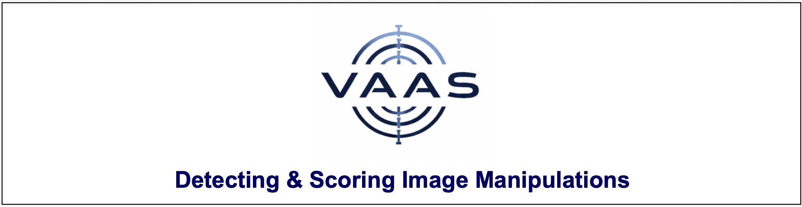
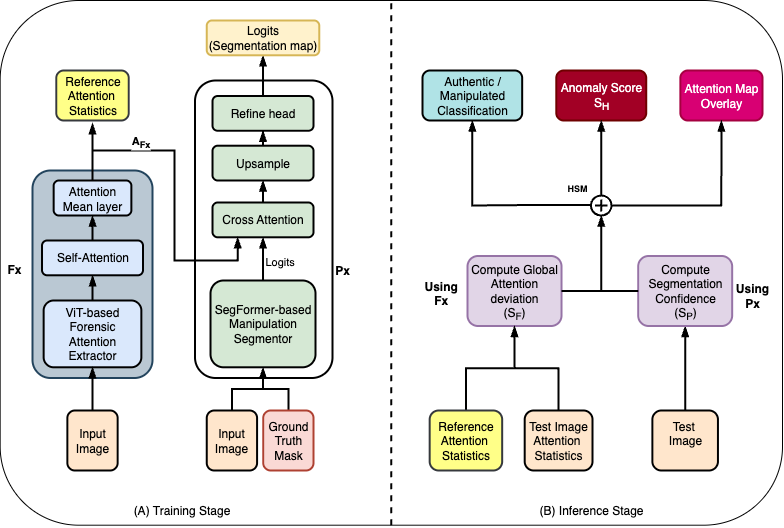
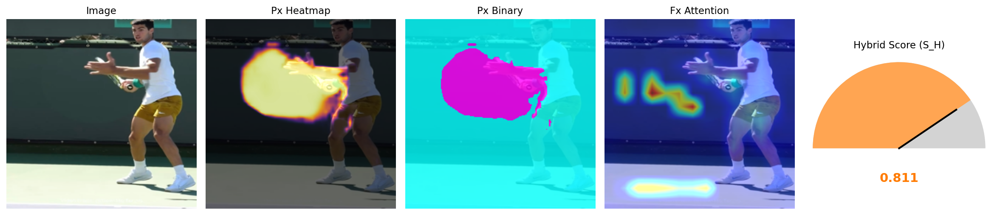

---

# VAAS: Vision-Attention Anomaly Scoring

[](https://doi.org/10.5281/zenodo.18064355)
[](https://github.com/OBA-Research/VAAS/actions/workflows/test.yaml)
[](https://huggingface.co/OBA-Research/vaas)
[](https://pypi.org/project/vaas/)

[](https://pypi.org/project/vaas/)
[](https://colab.research.google.com/drive/1HOt5j6Br0I5Yqv6oeu-jqL5G_n1-lGm8?usp=sharing)
[](LICENSE)

## What is VAAS?

VAAS is an inference-first, research-driven dual-module vision library for image integrity analysis. It integrates Vision Transformer attention with patch-level self-consistency analysis, with cross-attention conditioning between global and local representations.
*This repository provides the **inference-ready implementation** of VAAS for research engineers and practitioners.*

---

## Read Paper

* [Journal version (FSIDI / DFRWS EU 2026)](https://www.sciencedirect.com/science/article/pii/S266628172600020X)
* [Arxiv version](https://arxiv.org/abs/2512.15512)
* [Presentation Slides](https://opeyemibami.github.io/slides/vaas)

---

## Architecture



VAAS integrates two complementary components:

* **Fx — Global Attention Module**
  A Vision Transformer capturing semantic/global irregularities from attention patterns.

* **Px — Patch Consistency Module**
  A SegFormer-based model capturing local inconsistencies across image patches.

In the current version, Px is further conditioned via **cross-attention** using global features from Fx, enabling interaction between global context and local anomaly reasoning.

These combine to produce:

* `S_F` — global attention fidelity
* `S_P` — patch-level plausibility
* `S_H` — hybrid anomaly score (final)

`S_H` is continuous and reflects relative anomaly **intensity**, not a binary decision.

---

## Installation

```bash
pip install vaas
```

Or:

```bash
uv add vaas
```

**Important:** VAAS requires PyTorch and torchvision at inference time.

Install PyTorch:
https://pytorch.org/get-started/locally/

---

## Usage

```python
from vaas.inference.pipeline import VAASPipeline
from PIL import Image
import requests
from io import BytesIO

pipeline = VAASPipeline.from_pretrained(
    "OBA-Research/vaas",
    device="cpu",
    alpha=0.5,
    model_variant="v2-base-df2023",
)

url = "https://raw.githubusercontent.com/OBA-Research/VAAS/main/examples/images/alcaraz.jpg"
image = Image.open(BytesIO(requests.get(url).content)).convert("RGB")

result = pipeline(image)
print(result)
```

---

#### Output format

```python
{
  "S_F": float,
  "S_P": float,
  "S_H": float,
  "anomaly_map": ndarray
}
```

---

### Inference with visual explanation

VAAS can also generate a qualitative visualization combining:

* Patch-level anomaly heatmaps (Px)
* Global attention maps (Fx)
* Final hybrid anomaly score (S_H)

```python

pipeline.visualize(
    image=image,
    save_path="vaas_visualization.png",
    mode="all",        # options: "all", "px", "binary", "fx"
    threshold=0.5,
)
```

This will save a figure containing:

* Input image
* Patch-level anomaly overlays
* Global attention overlays
* A gauge-style visualization of the hybrid anomaly score

For examples:



---

## Documentation and Examples

👉 [APIs and Usage Documentation](docs/usage/api_doc.md)

👉 [colab notebooks](https://drive.google.com/drive/folders/1xA0OdPgz9C8OL63nfl_nlUcZ-wWeRz84?usp=sharing)

👉 [v2 notebooks](examples/notebooks/vaas_v2/)

👉 [v1 notebooks](examples/notebooks/vaas_v017/)

---

## Model Variants

### v2 (Cross-Attention VAAS)

| Models                | Training Data | Description                                       | Hugging Face                                                   |
| --------------------- | ------------- | ------------------------------------------------- | -------------------------------------------------------------- |
| vaas-v2-base-df2023   | DF2023 (10%)  | Lightweight inference with cross-attention fusion | https://huggingface.co/OBA-Research/vaas/tree/v2-base-df2023   |
| vaas-v2-medium-df2023 | DF2023 (≈50%) | Balanced performance and localisation             | https://huggingface.co/OBA-Research/vaas/tree/v2-medium-df2023 |
| vaas-v2-large-df2023  | DF2023 (100%) | Full-scale training with strongest sensitivity    | https://huggingface.co/OBA-Research/vaas/tree/v2-large-df2023  |

---

## V1 Model Variants

| Models                | Training Data | Description                      | Reported Evaluation (Paper)                                                 | Hugging Face Model                                                                      |
| --------------------- | ------------- | -------------------------------- | --------------------------------------------------------------------------- | --------------------------------------------------------------------------------------- |
| vaas-v1-base-df2023   | DF2023 (10%)  | Initial public inference release | [F1 & IoU are reported in research paper](https://arxiv.org/pdf/2512.15512) | [vaas-v1-base-df2023](https://huggingface.co/OBA-Research/vaas)                         |
| vaas-v1-medium-df2023 | DF2023 (≈50%) | Scale-up experiment              | 5% better than base                                                         | [vaas-v1-medium-df2023](https://huggingface.co/OBA-Research/vaas/tree/v1-medium-df2023) |
| vaas-v1-large-df2023  | DF2023 (100%) | Full-dataset training            | 9% better than medium                                                       | [vaas-v1-large-df2023](https://huggingface.co/OBA-Research/vaas/tree/v1-large-df2023)   |

---

## Notes on Model Scope

VAAS models may be trained with emphasis on different classes of visual integrity violations (e.g. splicing, identity manipulation, text editing, structural deformation, or AI-generated artifacts).

These variants share the same inference API and scoring framework, but may differ in training data composition and calibration depending on the target integrity focus.

---

<!-- ## Roadmap (Inference-Focused)

* Batch inference and folder-level CLI
* Richer visualisation modes
* More efficient backbones
* Expose rich image embeddings
* Cross-dataset inferencing
* Model compression
* Extended anomaly-map visualisation
* ONNX / TorchScript export
* Use cases and extensions -->

---

## Contributing

We welcome contributions that improve the usability, robustness, and extensibility of VAAS.

See [**CONTRIBUTING.md**](https://github.com/OBA-Research/VAAS/blob/main/CONTRIBUTING.md)

---

## Citation

```python
@software{vaas,
  title        = {VAAS: Vision-Attention Anomaly Scoring},
  author       = {Bamigbade, Opeyemi and Scanlon, Mark and Sheppard, John},
  year         = {2025},
  publisher    = {Zenodo},
  doi          = {10.5281/zenodo.18064355}
}
```

```python
@article{BAMIGBADE2026302063,
title = {VAAS: Vision-Attention Anomaly Scoring for image manipulation detection in digital forensics},
journal = {Forensic Science International: Digital Investigation},
volume = {56},
pages = {302063},
year = {2026},
note = {DFRWS EU 2026 - Selected Papers from the 13th Annual Digital Forensics Research Conference Europe},
issn = {2666-2817},
doi = {https://doi.org/10.1016/j.fsidi.2026.302063},
url = {https://www.sciencedirect.com/science/article/pii/S266628172600020X},
author = {Opeyemi Bamigbade and Mark Scanlon and John Sheppard},
keywords = {Digital forensics, Image manipulation detection, Tamper localisation, Explainable AI, Vision transformers, Segmentation, Attention mechanisms, Anomaly scoring},
abstract = {Recent advances in AI-driven image generation have introduced new challenges for verifying the authenticity of digital evidence in forensic investigations. Modern generative models can produce visually consistent forgeries that evade traditional detectors based on pixel or compression artefacts. Most existing approaches also lack an explicit measure of anomaly intensity, which limits their ability to quantify the severity of manipulation. This paper introduces Vision-Attention Anomaly Scoring (VAAS), a novel dual-module framework that integrates global attention-based anomaly estimation using Vision Transformers (ViT) with patch-level self-consistency scoring derived from segmentation embeddings. The hybrid formulation provides a continuous and interpretable anomaly score that reflects both the location and degree of manipulation. Evaluations on the DF2023 and CASIA v2.0 datasets demonstrate that VAAS achieves competitive F1 and IoU performance, while enhancing visual explainability through attention-guided anomaly maps. The framework bridges quantitative detection with human-understandable reasoning, supporting transparent and reliable image integrity assessment. The source code for all experiments and corresponding materials for reproducing the results are available open source.}
}
```

---

## License

MIT License

---

## Maintainers

**OBA-Research**
- https://github.com/OBA-Research
- https://huggingface.co/OBA-Research
